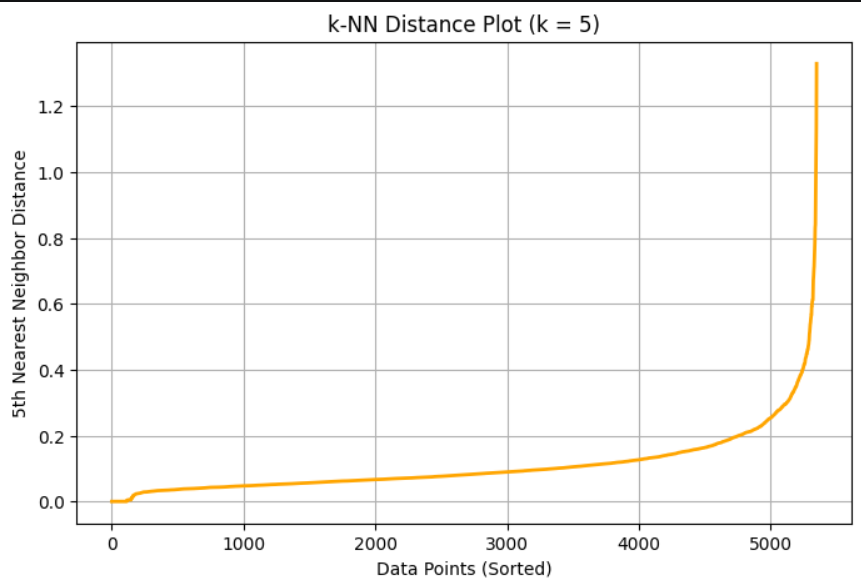
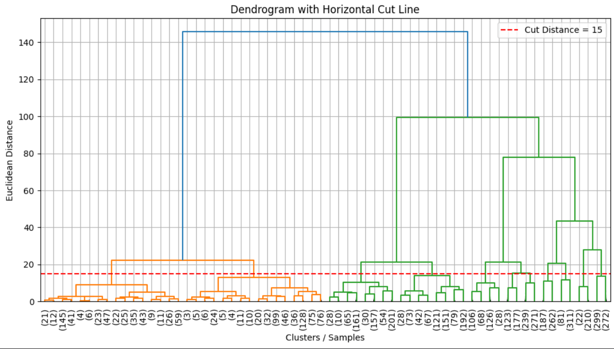
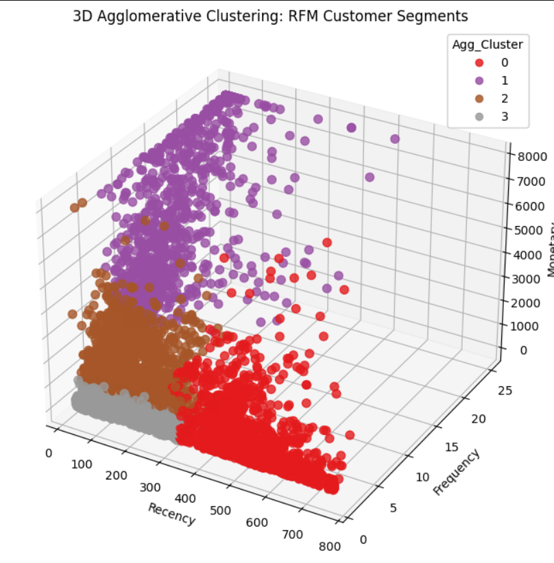

# 🛍️ Customer Segmentation using Unsupervised Learning

### 🎯 Unsupervised Learning Practical Exam Project

**Customer Segmentation using RFM Analysis, K-Means, Hierarchical Clustering & DBSCAN**

---
</div>

# 📖 Project Overview

This project was developed as part of the **Unsupervised Learning Practical Examination**.

The objective is to analyze customer purchasing behaviour from the **Online Retail II Dataset** and segment customers into meaningful groups using clustering algorithms.

Instead of sending identical promotional offers to every customer, businesses like **Flipkart** or **Meesho** can target different customer groups with personalized marketing campaigns.

The project follows the complete Data Science workflow:

- Data Cleaning
- Exploratory Data Analysis (EDA)
- RFM Feature Engineering
- Data Preprocessing
- K-Means Clustering
- Hierarchical Clustering
- DBSCAN
- Model Evaluation
- Business Recommendations
- Model Deployment

---

# 🎯 Problem Statement

Marketing teams often send the same promotional emails to every customer.

This approach results in

- Low conversion rate
- Customer dissatisfaction
- High marketing cost

This project solves the problem by automatically grouping customers into meaningful clusters based on purchasing behaviour.

---

# 📂 Dataset

- [online_retail_II.csv](online_retail_II.csv)

## Streamlit link

- [https://unsupervised-learning-practical-exam.streamlit.app/]


Dataset contains approximately

- 1 Million Transactions
- Years: 2009–2011
- 8 Features

| Column |
|---------|
| InvoiceNo |
| StockCode |
| Description |
| Quantity |
| InvoiceDate |
| UnitPrice |
| CustomerID |
| Country |

---

# ⚙️ Technologies Used

- Python
- Pandas
- NumPy
- Matplotlib
- Seaborn
- Plotly
- Scikit-Learn
- SciPy
- Joblib
- Jupyter Notebook

---

# 📊 Project Workflow

## Step 1

Data Loading

## Step 2

Data Cleaning

- Missing Values
- Duplicate Records
- Invalid Transactions
- UK Customers Only

---

## Step 3

Exploratory Data Analysis

- Histograms
- Countplots
- Monthly Sales
- Customer Spend
- Pareto Analysis

---

## Step 4

RFM Feature Engineering

- Recency
- Frequency
- Monetary

---

## Step 5

Preprocessing

- Winsorization
- Log Transformation
- StandardScaler

---

## Step 6

K-Means Clustering

- Elbow Method
- Silhouette Score
- Cluster Profiling

---

## Step 7

Hierarchical Clustering

- Dendrogram
- Ward Linkage
- Cluster Comparison

---

## Step 8

DBSCAN

- k-NN Distance Plot
- Hyperparameter Tuning
- Noise Detection
- Cluster Profiling

---

## Step 9

Algorithm Comparison

Evaluation Metrics

- Silhouette Score
- Davies-Bouldin Index
- Calinski-Harabasz Index

---

# 📈 Customer Personas

## 🏆 Champions

Recent buyers

Frequent shoppers

Highest spending customers

### Marketing Action

Exclusive Flipkart Plus Membership

---

## 💎 Loyal Customers

Regular customers

Consistent purchasing behaviour

### Marketing Action

Reward Points

Cashback

Personalized Recommendations

---

## 🛒 Regular Customers

Average purchasing behaviour

Moderate spending

### Marketing Action

Cross-selling

Bundle Offers

Festival Discounts

---

## ⚠️ At-Risk Customers

Not purchased recently

Likely to churn

### Marketing Action

20% Discount Coupon

Reminder Emails

Win-back Campaign

---

## ⭐ VIP / Outlier Customers (DBSCAN Noise)

Unique purchasing behaviour

Highest-value customers

### Marketing Action

Premium Customer Support

Exclusive Product Launches

VIP Rewards

---

# 📊 Algorithms Used

✅ K-Means Clustering

✅ Agglomerative Hierarchical Clustering

✅ DBSCAN

---

# 📌 Evaluation Metrics

- Silhouette Score
- Davies-Bouldin Index
- Calinski-Harabasz Index

---

# 📷 Project Screenshots

## Plot chart

- 

---

## Dendrogram

- 

---

## 3D Cluster Plot

- 

---

# 📁 Repository Structure

```
customer-segmentation-unsupervised-learning
│
├── CustomerSegmentation_UnsupervisedLearning.ipynb
├── rfm_scaler.pkl
├── customer_segmentation_model.pkl
├── summary_report.md
├── requirements.txt
├── README.md
├── images
└── dataset
```


# 🎥 Project Demonstration Video

Video Link

```
Paste Your Google Drive or YouTube Video Link Here
```

---

# 📌 Future Improvements

- Deep Learning based Segmentation
- Real-Time Customer Segmentation API
- Recommendation System
- Customer Lifetime Value Prediction
- Auto Marketing Dashboard
- Streamlit Deployment

---

# 👩‍💻 Author

**Janki Dholariya**

Data Science | Machine Learning | Python

---
